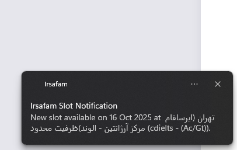

# Irsafam IELTS Slot Monitor

This automatically monitors the [Irsafam](https://irsafam.org/ielts/timetable) IELTS timetable and sends you desktop notifications when test slots become available.

## Why This Exists

If you're trying to book an IELTS test in Iran, you know the struggle:
- All slots are usually fully booked (تکمیل ظرفیت)
- You need to constantly refresh the website hoping someone cancels
- New slots (and canceled slots duting last week) typically become available on Mondays when Sanjesh updates test pricing
- Missing an available slot means waiting weeks or months for the next opportunity

This monitor does the tedious checking for you and alerts you the moment a seat opens up!
It helped me find a seat, might help you too.

## How It Works

This uses Selenium to:
1. Load the Irsafam IELTS timetable page
2. Scroll through all available dates (since the page loads dynamically)
3. Parse the HTML to find test slots that aren't marked as "تکمیل ظرفیت" (full)
4. Send you a desktop notification when new slots appear
5. Keep track of slots it's already notified you about

## Usage

### Jupyter Notebook
- I've used it in this format but can be used as an script too.
1. Open `irsafamCrawl.ipynb` in Jupyter
2. Run the cells step by step
3. The monitor will start in the final cell

## Disclaimer

This tool is for educational purposes and personal use only. Please:
- Don't overload the Irsafam servers
- Respect the website's terms of service
- Use responsibly and ethically